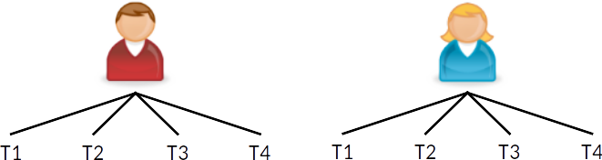
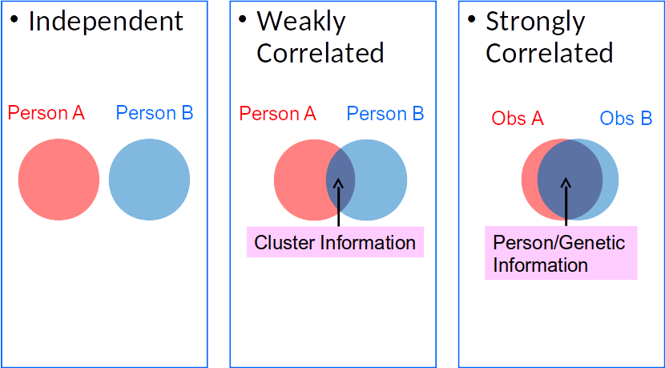
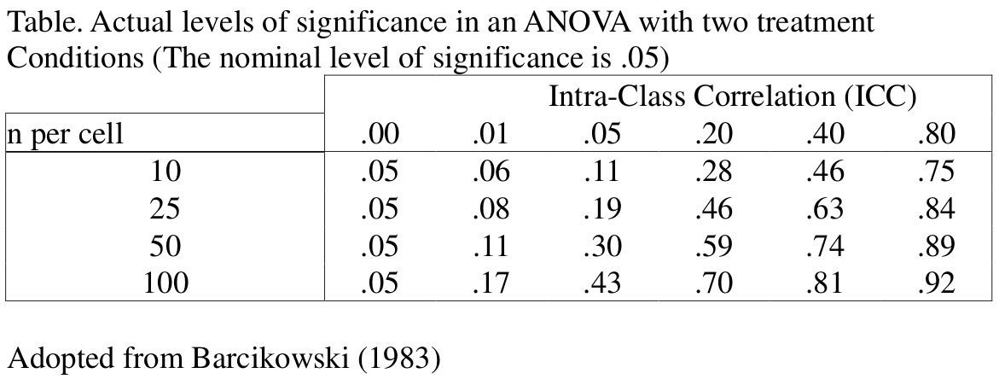

```{r setup, include=FALSE}
options(htmltools.dir.version = FALSE, digits = 3L)
library(tidyverse)
theme_set(theme_bw())
library(lme4)
library(rstan)
format_coef <- function(x, digits = 3L) {
  sprintf(paste0("%.", digits, "f"), x)
}
rmlead0 <- function(x, digits = 3L) {
  gsub("^0", "", format_coef(x, digits))
}
```

```{r load_refs, echo=FALSE, cache=FALSE}
library(RefManageR)
BibOptions(check.entries = FALSE, 
           bib.style = "authoryear", 
           cite.style = 'authoryear', 
           style = "markdown",
           hyperlink = FALSE, 
           dashed = FALSE)
myBib <- ReadBib("../references.bib", check = FALSE)
```

# Different Names

Hierarchical linear model `r Citep(myBib, "Raudenbush2002", before = "HLM; ")`

Mixed/Mixed-effects model `r Citep(myBib, "littell1996sas")`

Random coefficient model `r Citep(myBib, "DeLeeuw1986")`

Variance component model `r Citep(myBib, "Aitkin1986")`

---

# Roadmap

What are multilevel data?

Why use MLM?  
- Avoid underestimated _SE_
- Research questions at different levels
- Cluster-specific (or person-specific) regression lines

---

# Multilevel Data

Nested Data
- Students in classrooms/schools
- Siblings in families
- Clients in therapy groups/therapists/clinics
- Employees in organizations in countries


---

# Multilevel Data

- Repeated measures in individuals

.center[

]

### Network Graph

```{r, echo=FALSE, out.width='90%', out.height='20%'}
DiagrammeR::grViz("
digraph boxes_and_circles {
  graph [overlap = true, fontsize = 24]

  node [penwidth = 0]
  # Schools
  A; B; C; D
  # Students
  1; 2; 3; 4; 5; 6; 7; 8; 9; 10; 11

  # edges
  edge [dir = 'none']
  A -> {1; 2; 3}
  B -> {4; 5}
  C -> {6; 7; 8; 9}
  D -> {10; 11}
}
")
```

---

# Applications of MLM

Psychotherapy
- Heterogeneity of treatment effectiveness across therapists

Educational research
- teacher expectations on students' performance

Organizational research
- Job strain and ambulatory blood pressure

---

# Applications of MLM (cont'd)

Cross-national/neighborhood research
- Sociopolitical influence on psychological processes (e.g., age and generalized trust)
- Post-materialism, locus of control, and concern for global warming

Longitudinal analysis/repeated measures
- Aging, self-esteem, and stress appraisal

---

# Example Data

```{r popdata, include=FALSE}
popdata <- haven::read_spss("../data/popular2.sav") %>% 
  select(pupil, class, extrav, sex, texp, popular, popteach) %>% 
  mutate(sex = as_factor(sex))
```

Sample simulated data on students' popularity from Hox, Moerbeek, 
& van de Schoot (2018)
- `r nrow(popdata)` pupils (level 1) in `r n_distinct(popdata$class)` classrooms
(level 2)

.font60[
```{r, echo=FALSE, results='asis'}
popdata %>% map_chr(~ attributes(.)$label) %>% data.frame() %>% 
  rownames_to_column() %>% 
  knitr::kable(col.names = c("Variable", "Description"), format = "html")
```
]

---

class: clear

.font60[
```{r, echo=FALSE}
DT::datatable(popdata)
```
]

---

class: clear, center

```{r, echo=FALSE, message=FALSE, fig.height=6, dev='svg'}
popdata %>% sjlabelled::remove_all_labels() %>% 
  haven::zap_formats() %>% 
  GGally::ggpairs(mapping = aes(color = sex, alpha = 0.5), 
                  columns = c(3, 5:7), 
                  lower = list(
                    continuous = GGally::wrap(
                      "smooth", position = "jitter", size = 0.7)))
```

---

class: clear



---

# Quantify Clustering

Intraclass correlation:
$$\mathrm{ICC} = \frac{\sigma^2_\text{cluster}}
                      {\sigma^2_\text{cluster} + \sigma^2_\text{individual}}$$

ICC = prop. var at cluster level  
    = average correlation between two individuals in the same cluster
    
Variance components: $\sigma^2_\text{cluster}$, $\sigma^2_\text{individual}$
    
---

class: clear

Check the variability of (a) classroom means and (b) within a classroom

.pull-left[
```{r, echo=FALSE, message=FALSE, dev='svg', fig.height=4, fig.width=4}
set.seed(1)
popsub <- popdata %>% 
  mutate(class = factor(class)) %>% 
  filter(class %in% sample(class, 10))
popsub %>% 
  ggplot(aes(x = class, y = popular)) + 
  geom_jitter(width = 0.1, height = 0, col = "grey40") + 
  stat_summary(geom = "point", fun.y = "mean", col = "red", 
               shape = 18, size = 4)
```
]

.pull-right[
```{r m0, include=FALSE}
m0 <- lmer(popular ~ (1 | class), data = popdata)
```
\\(\hat\sigma^2_\text{cluster} = `r (m0@theta * sigma(m0))^2 %>% format_coef()`\\)

\\(\hat\sigma^2_\text{individual} = `r sigma(m0)^2 %>% format_coef()`\\)

\begin{align*}
  \mathrm{ICC} & = \frac{`r (m0@theta * sigma(m0))^2 %>% format_coef()`}
                      {`r (m0@theta * sigma(m0))^2 %>% format_coef()` + 
                       `r sigma(m0)^2 %>% format_coef()`} \\
               & = `r rmlead0(1 / (1 + 1 / m0@theta^2))`
\end{align*}

What does that mean?
]

---

# Dependent (Correlated) Observations

With clustered data, an assumption of OLS regression is violated

One score inform another score in the same cluster

Overlap: reduces effective information (\\(N_\text{eff}\\)) in data

.center[

]

---

# Consequences

Assuming independent obs, OLS understates the uncertainty in the estimates
- _SE_ too small; CI too narrow

$${\uparrow}\, t = \frac{\hat\beta}{\mathit{SE}(\hat \beta)\, \downarrow}$$

---

# Comparing OLS with MLM

.code30[
.pull-left[
```{r, echo=FALSE, highlight.output=c(17, 18)}
m1_lm <- lm(popular ~ texp, data = popdata)
summary(m1_lm)
```
]

.pull-right[
```{r, echo=FALSE, highlight.output=c(19, 20)}
m1 <- lmer(popular ~ texp + (1 | class), data = popdata)
summary(m1)
```
]
]

---

class: clear

.pull-left[
```{r, echo=FALSE, message=FALSE, dev='svg', fig.width=4, fig.height=4}
ggplot(popdata, aes(x = texp, y = popular)) + 
  geom_point(size = 0.5, alpha = 0.5, aes(col = factor(class))) + 
  guides(col = FALSE) + 
  geom_smooth(method = "lm", col = "red")
```
OLS:  
95% CI [`r confint(m1_lm, parm = "texp")[1] %>% format_coef`, 
        `r confint(m1_lm, parm = "texp")[2] %>% format_coef`]. 
]

.pull-right[
```{r, echo=FALSE, message=FALSE, dev='svg', fig.width=4, fig.height=4}
X <- m1@frame[ , 2]
var_yhat <- vcov(m1)[1, 1] + X^2 * vcov(m1)[2, 2] + 
  2 * X * vcov(m1)[2, 1]
m1_cis <- popdata %>% mutate(fit = predict(m1, re.form = NA), 
                             lwr = fit - 2 * sqrt(var_yhat), 
                             upr = fit + 2 * sqrt(var_yhat))
ggplot(popdata, aes(x = texp, y = popular)) + 
  geom_ribbon(data = m1_cis, aes(ymin = lwr, ymax = upr), fill = "skyblue") + 
  geom_point(size = 0.5, alpha = 0.5, aes(col = factor(class))) + 
  guides(col = FALSE) + 
  geom_abline(intercept = fixef(m1)[1], slope = fixef(m1)[2], 
              col = "red")
```
MLM:  
95% CI [`r confint(m1, parm = "texp")[1] %>% format_coef`, 
        `r confint(m1, parm = "texp")[2] %>% format_coef`]. 
]

---

# Type I Error Inflation



Depends on _design effect_: 1 + (cluster size - 1) × ICC

What's the design effect for the popularity data?

---

class: clear

`r Citet(myBib, "Lai2015")`: MLM needed when __design effect > 1.1__

For the popularity data, design effect  
= 1 + (20 - 1) × `r rmlead0(1 / (1 + 1 / m0@theta^2))` = 
`r format_coef(1 + (20 - 1) / (1 + 1 / m0@theta^2))`

\\(N_\text{eff}\\) reduces by almost 8 times: 2000 → 
`r round(2000 / (1 + (20 - 1) / (1 + 1 / m0@theta^2)))`
---

# Random Coefficient Model

For lv-2 predictor, OLS generally results in underestimated _SE_

For lv-1 predictor, in addition to problem on _SE_, OLS result does not show 
heterogeneity across groups

---

# OLS With All Data

Consider `extrav` --> `popular` (with `extrav` mean centered)

```{r p, message=FALSE, echo=FALSE, dev='svg', fig.width=6.5, fig.height=4.5, fig.align='center'}
class_col3 <- RColorBrewer::brewer.pal(n = 3, name = "Set1")
popdata <- popdata %>% 
  mutate(extravc = extrav - mean(extrav))
p <- ggplot(popdata, aes(x = extravc, y = popular)) + 
  geom_point(size = 0.5, alpha = 0.5)
p + geom_smooth(method = "lm", se = FALSE, 
                fullrange = TRUE, col = "black")
```

---

# Think About Just One Classroom

$$\texttt{popular}_i = \beta_0 + \beta_1 \texttt{extrav}_i + e_i$$

```{r p1, message=FALSE, echo=FALSE, dev='svg', fig.width=6.5, fig.height=4.5, fig.align='center'}
p + geom_point(data = popdata %>% filter(class == 1), 
               col = class_col3[1], size = 3, shape = 19) + 
    geom_smooth(data = popdata %>% filter(class == 1), 
                col = class_col3[1], method = "lm", se = FALSE, 
                fullrange = TRUE)
```

---

# Think About Just One Classroom

$$\texttt{popular}_{i\color{red}{1}} = \beta_{0\color{red}{1}} + \beta_{1\color{red}{1}} \texttt{extrav}_{i\color{red}{1}} + e_{i\color{red}{1}}$$

```{r, ref.label="p1", message=FALSE, echo=FALSE, dev='svg', fig.width=6.5, fig.height=4.5, fig.align='center'}
p + geom_point(data = popdata %>% filter(class == 1), 
               col = class_col3[1], size = 3, shape = 19) + 
    geom_smooth(data = popdata %>% filter(class == 1), 
                col = class_col3[1], method = "lm", se = FALSE, 
                fullrange = TRUE)
```

---

# Think About Classroom 35

$$\texttt{popular}_{i\color{blue}{35}} = \beta_{0\color{blue}{35}} + \beta_{1\color{blue}{35}} \texttt{extrav}_{i\color{blue}{35}} + e_{i\color{blue}{35}}$$

```{r p2, message=FALSE, echo=FALSE, dev='svg', fig.width=6.5, fig.height=4.5, fig.align='center'}
p + geom_point(data = popdata %>% filter(class == 35), 
               col = class_col3[2], size = 3, shape = 17) + 
    geom_smooth(data = popdata %>% filter(class == 35), 
                col = class_col3[2], method = "lm", se = FALSE, 
                fullrange = TRUE)
```

---

# Classroom 14

$$\texttt{popular}_{i\color{green}{14}} = \beta_{0\color{green}{14}} + \beta_{1\color{green}{14}} \texttt{extrav}_{i\color{green}{14}} + e_{i\color{green}{14}}$$

```{r p3, message=FALSE, echo=FALSE, dev='svg', fig.width=6.5, fig.height=4.5, fig.align='center'}
p + geom_point(data = popdata %>% filter(class == 14), 
               col = class_col3[3], size = 3, shape = 15) + 
    geom_smooth(data = popdata %>% filter(class == 14), 
                col = class_col3[3], method = "lm", se = FALSE, 
                fullrange = TRUE)
```

---

class: clear

## OLS Lines for 100 Classrooms + Average Line

$$\texttt{popular}_{i\color{purple}{j}} = \beta_{0\color{purple}{j}} + \beta_{1\color{purple}{j}} \texttt{extrav}_{i\color{purple}{j}} + e_{i\color{purple}{j}}$$

```{r m2s, include=FALSE}
library(lme4)
m2s <- lmer(popular ~ extravc + (extravc | class), data = popdata)
print(summary(m2s, correlation = FALSE), show.resids = FALSE, digits = 2L)
```

```{r, message=FALSE, echo=FALSE, dev='svg', fig.width=6.5, fig.height=4.5, fig.align='center'}
ggplot(popdata, aes(x = extravc, y = popular, col = factor(class))) + 
  geom_point(size = 0.5, alpha = 0.5) + 
  geom_smooth(method = "lm", se = FALSE, size = 0.5) + 
  geom_abline(intercept = m2s@beta[1], slope = m2s@beta[2], 
              size = 1.5) + 
  guides(col = FALSE)
```

---

# Partial Pooling

For each classroom, $n = 10$ for OLS

For average line, $N = 1,000$

MLM with __partial pooling__: weighted average of the OLS line and the average
line
- Borrowing information from other clusters

???

Get more stable estimates of regression lines

---

class:clear

.pull-left[
OLS
```{r, message=FALSE, echo=FALSE, dev='svg', fig.width=4, fig.height=4}
ggplot(popdata, aes(x = extravc, y = popular, col = factor(class))) + 
  geom_smooth(method = "lm", se = FALSE, size = 0.5) + 
  geom_abline(intercept = m2s@beta[1], slope = m2s@beta[2], 
              size = 1.5) + 
  guides(col = FALSE)
```
]

.pull-right[
MLM
```{r, message=FALSE, echo=FALSE, dev='svg', fig.width=4, fig.height=4}
# Get the predicted values for plotting from `lme4`
predict_ran_slp <- popdata %>% 
  select(class, extravc, texp) %>% 
  mutate(fit = predict(m2s))
ggplot(data = predict_ran_slp, 
       aes(x = extravc, y = fit, color = factor(class))) +
  geom_smooth(method = "lm", se = FALSE, size = 0.5) + 
  labs(y = "popular") + 
  geom_abline(intercept = m2s@beta[1], slope = m2s@beta[2], 
              size = 1.5) + 
  guides(color = FALSE)
```
]

---

class:clear

$\beta_{0j}$ and $\beta_{1j}$ assumed to come from normal distributions
- $\beta_{0j} \sim \mathcal{N}(\gamma_{00}, \sigma^2_{u_0})$
- $\beta_{1j} \sim \mathcal{N}(\gamma_{10}, \sigma^2_{u_1})$

.pull-left[
Fixed effects
- $\gamma_{00}$: average intercept
- $\gamma_{10}$: average slope
]

.pull-right[
Random effects
- $u_{0j}$: $\beta_{0j} - \gamma_{00}$
- $u_{1j}$: $\beta_{1j} - \gamma_{10}$
]

---

# Fixed Effect Estimates

.code50[
```{r, ref.label="m2s", highlight.output=14:17}

```
]

---

# Random Effect __Variance__ Estimates

.code50[
```{r, ref.label="m2s", highlight.output=8:12}

```
]

---

# $u_{0j}$ and $u_{1j}$ Estimates

```{r, echo=FALSE}
ranef(m2s)$class
```

---

class: clear

Heterogeneity in the slopes: OLS gives underestimated _SE_ of the average
slope `r Citep(myBib, "Lai2015")`

Falsely assuming constant slopes across groups
- Heterogeneity in slopes can be an important research question

---

# Cross-Level Interaction

Whether a class-level variable explains variations in class-specific slopes

```{r, message=FALSE, echo=FALSE, dev='svg', fig.width=6.5, fig.height=4.5, fig.align='center'}
ggplot(data = predict_ran_slp, 
       aes(x = extravc, y = fit, group = factor(class), 
           col = texp > 15)) +
  geom_smooth(method = "lm", se = FALSE, size = 0.5) + 
  labs(y = "popular") + 
  geom_abline(intercept = m2s@beta[1], slope = m2s@beta[2], 
              size = 1.5)
```

???

What do you observe from the graph?

---

# Ecological Fallacy

Association between two variables can be different across levels

```{r, message=FALSE, warning=FALSE, echo=FALSE, dev='svg', fig.width=6.5, fig.height=4.5, fig.align='center'}
# popdata <- popdata %>% 
#   group_by(class) %>% 
#   mutate(extravc_cm = mean(extravc), 
#          extravc_cmc = extravc - extravc_cm)
# m2s_dc <- lmer(popular ~ extravc_cm + extravc_cmc + (extravc_cmc | class), 
#                data = popdata)
# Disaggregation
popdata_lv2 <- popdata %>% 
  group_by(class) %>% 
  summarise(extravc = mean(extravc), 
            popular = mean(popular))
ggplot(popdata, aes(x = extravc, y = popular, col = factor(class))) + 
  geom_point(size = 0.5, alpha = 0.5) + 
  geom_smooth(method = "lm", se = FALSE, size = 0.5) + 
  geom_abline(intercept = m2s@beta[1], slope = m2s@beta[2], 
              linetype = "dashed", size = 1) + 
  geom_point(data = popdata_lv2, aes(fill = factor(class)), col = "black", 
             size = 3, shape = 24) + 
  geom_smooth(data = popdata_lv2, method = "lm", se = FALSE, fullrange = TRUE, 
              size = 1.5, col = "red") + 
  guides(col = FALSE, fill = FALSE)
```

---

class: clear

```{r m3_stan, cache=TRUE, cache.vars="m3_stan", include=FALSE}
pop_sdata <- with(popdata,
                  list(N = nrow(popdata),
                       y = popular,
                       K = 2,
                       X = cbind(1, extrav),
                       q = 2,
                       gid = as.integer(class),
                       J = n_distinct(class)))
m3_stan <- stan("../codes/stan_gpc_pv_ran_slp.stan", data = pop_sdata,
                cores = 2L, chains = 2L, iter = 1000L,
                pars = c("b0", "b", "bm", "b_contextual", "sigma_y", "tau_y",
                         "sigma_x", "tau_x"))
```

.font90[
Class-level coefficient: $\hat \gamma_{01}$ = 
`r get_posterior_mean(m3_stan, par = "bm")[3]`, 
95% CI [`r summary(m3_stan, probs = .025, pars = "bm")$summary[4]`, 
`r summary(m3_stan, probs = .975, pars = "bm")$summary[4]`]
]

.code40[
```{r m3_stan_out, echo=FALSE, highlight.output=8}
print(m3_stan, probs = c(.025, .5, .975))
```
]

.footnote[
[1] With Bayesian estimation
]

---

class: clear

.font90[
Student-level coefficient: $\hat \gamma_{10}$ = 
`r get_posterior_mean(m3_stan, par = "b[1]")[3]`, 
95% CI [`r summary(m3_stan, probs = .025, pars = "b[1]")$summary[4]`, 
`r summary(m3_stan, probs = .975, pars = "b[1]")$summary[4]`]
]

.code40[
```{r, ref.label='m3_stan_out', echo=FALSE, highlight.output=7}
```
]

.footnote[
[1] With Bayesian estimation
]

---

class: clear

.font90[
Contextual effect: $\hat \gamma_{10} - \hat \gamma_{01}$ = 
`r get_posterior_mean(m3_stan, par = "b_contextual")[3]`, 
95% CI [`r summary(m3_stan, probs = .025, pars = "b_contextual")$summary[4]`, 
`r summary(m3_stan, probs = .975, pars = "b_contextual")$summary[4]`]
]

.code40[
```{r, ref.label='m3_stan_out', echo=FALSE, highlight.output=9}
```
]

.footnote[
[1] With Bayesian estimation
]

---

# Growth Curve Analysis

Individual as "cluster"

```{r, echo=FALSE, message=FALSE, dev='svg', fig.width=6.5, fig.height=4.5, fig.align='center'}
tolerance <- read_csv("https://stats.idre.ucla.edu/wp-content/uploads/2016/02/tolerance1_pp.txt")
tolerance %>% 
  ggplot(aes(x = time, y = tolerance, col = factor(male), group = id)) + 
  geom_line()
```

---

# Other Forms of Clustering

Three-level 

```{r, echo=FALSE, out.width='90%', out.height='30%'}
DiagrammeR::grViz("
digraph boxes_and_circles {
  graph [overlap = true, fontsize = 24]

  node [penwidth = 0]
  # District
  AB [label='District 1']
  CD [label='District 2']
  # Schools
  A; B; C; D
  # Students
  1; 2; 3; 4; 5; 6; 7; 8; 9; 10; 11

  # edges
  edge [dir = 'none']
  AB -> {A; B}
  CD -> {C; D}
  A -> {1; 2; 3}
  B -> {4; 5}
  C -> {6; 7; 8; 9}
  D -> {10; 11}
}
")
```

---

# Other Forms of Clustering

Cross-classification

```{r, echo=FALSE, out.width='90%', out.height='30%'}
DiagrammeR::grViz("
digraph boxes_and_circles {
  graph [overlap = true, fontsize = 24]

  node [penwidth = 0]
  # District
  n1 [label='Neighborhood 1']
  n2 [label='Neighborhood 2']
  n3 [label='Neighborhood 3']
  # Schools
  A; B; C; D
  # Students
  1; 2; 3; 4; 5; 6; 7; 8; 9; 10; 11

  # edges
  edge [dir = 'none']
  A -> {1; 2; 3}
  B -> {4; 5}
  C -> {6; 7; 8; 9}
  D -> {10; 11}
  {1; 4; 5} -> n1
  {2; 3; 6; 7} -> n2
  {8; 9; 10; 11} -> n3
}
")
```

Partial Nesting

```{r, echo=FALSE, out.width='90%', out.height='20%'}
DiagrammeR::grViz("
digraph boxes_and_circles {
  graph [overlap = true, fontsize = 24]

  node [penwidth = 0]
  # Schools
  A; B; C
  D [style = invis]
  # Students
  1; 2; 3; 4; 5; 6; 7; 8; 9; 10; 11

  # edges
  edge [dir = 'none']
  A -> {1; 2; 3}
  B -> {4; 5}
  C -> {6; 7} 
  D -> {8; 9; 10; 11} [style = invis]
}
")
```

---

# Additional Resources

Chapter from `r Citet(myBib, "Cohen2003")`

Book by [`r Citet(myBib, "Hox2018")`](https://multilevel-analysis.sites.uu.nl/) (textbook for the Spring 2019 class)

Book by [`r Citet(myBib, "Raudenbush2002")`](https://www.amazon.com/Hierarchical-Linear-Models-Applications-Quantitative/dp/076191904X) (more technical reference)

Book by [`r Citet(myBib, "Gelman2007")`](http://www.stat.columbia.edu/~gelman/arm/)

Paper by [`r Citet(myBib, "Enders2007")`](http://psycnet.apa.org/doiLanding?doi=10.1037/1082-989X.12.2.121) on centering

---

# Bibliography

.font70[
```{r, 'refs', results='asis', echo=FALSE}
PrintBibliography(myBib, end = 5L)
```
]

---

class: clear

.font70[
```{r, 'refs2', results='asis', echo=FALSE}
PrintBibliography(myBib, start = 6L)
```
]

---

class: clear, center, middle, inverse

# Thanks!

Slides created via the R package [**xaringan**](https://github.com/yihui/xaringan).

---

# .font80[(Unconditional) Random Intercept Model]

.pull-left[
`popular` score of student $i$ in class $j$   
= Mean `popular` score of class $j$ + deviation of student $i$ from class mean

Lv-1: $\texttt{popular}_{ij} = \beta_{0j} + e_{ij}$
]

.pull-right[
```{r, echo=FALSE, warning=FALSE, message=FALSE, dev='svg', fig.width=4, fig.height=4}
popsub %>% filter(class == "7") %>% 
  ggplot(aes(x = class, y = popular)) + 
  geom_point() + 
  stat_summary(geom = "point", col = "red", size = 3) + 
  geom_point(y = popsub$popular[1], col = "green", size = 3) + 
  geom_segment(x = 0.95, xend = 0.95, 
               y = mean(popsub$popular[popsub$class == "7"]), 
               yend = popsub$popular[1], 
               arrow = arrow(ends = "both", length = unit(0.1, "inches")), 
               col = "green") + 
  annotate("text", x = 1.1, y = mean(popsub$popular[popsub$class == "7"]), 
           label = "beta[0][7]", parse = TRUE, col = "red", size = 5) + 
  annotate("text", x = 0.9, 
           y = (mean(popsub$popular[popsub$class == "7"]) + popsub$popular[1]) / 2, 
           label = "italic(e)[1][7]", parse = TRUE, 
           col = "green", size = 5) + 
  ylim(range(popsub$popular))
```
]

---

# .font80[(Unconditional) Random Intercept Model]

.pull-left[
Mean `popular` score of class $j$   
= Grand mean + deviation of class $j$ from Grand mean

Lv-2: $\beta_{0j} = \gamma_{00} + u_{0j}$
]

.pull-right[
```{r, echo=FALSE, warning=FALSE, message=FALSE, dev='svg', fig.width=4.5, fig.height=5.5}
popsub %>% 
    ggplot(aes(x = class, y = popular)) + 
    geom_hline(yintercept = mean(popdata$popular), col = "blue") + 
    geom_jitter(width = 0.01, height = 0, color = "grey") + 
    stat_summary(geom = "point", col = "red", size = 3) + 
    geom_segment(aes(x = 1:10 + 0.2, xend = 1:10 + 0.2, 
                     y = pop_m), 
                 yend = mean(popdata$popular), 
                 data = popsub %>% group_by(class) %>% 
                     summarise(pop_m = mean(popular)), 
                 arrow = arrow(ends = "both", length = unit(0.1, "inches")), 
                 col = "red") + 
    annotate("text", x = 0.9, y = mean(popsub$popular[popsub$class == "7"]) - 0.2, 
             label = "beta[0][7]", parse = TRUE, col = "red", size = 5) + 
    annotate("text", x = 0.9, y = mean(popdata$popular) + 0.2, 
             label = "gamma[0][0]", parse = TRUE, col = "blue", size = 5) + 
    annotate("text", x = 1.6, 
             y = (mean(popsub$popular[popsub$class == "7"]) + 
                      mean(popdata$popular)) / 2, 
             label = "italic(u)[0][7]", parse = TRUE, 
             col = "red", size = 5) + 
    ylim(range(popsub$popular))
```
]

---

# .font80[(Unconditional) Random Intercept Model]

Overall model: $\texttt{popular}_{ij} = \gamma_{00} + u_{0j} + e_{ij}$

Fixed effects $(\gamma_{00})$: constant for everyone

Random effects $(u_{0j}, e_{ij})$: varies across clusters
- Usually assumed normally distributed
- Variance components: variance of random effects

---

class: clear

.code50[
```{r, highlight.output=c(13, 14, 19)}
m0 <- lmer(popular ~ (1 | class), data = popdata)
summary(m0)
```
]

---

# Interpreting the Output

- Estimated grand mean $(\hat \gamma_{00})$ = `r format_coef(fixef(m0))`
- Estimated classroom-level variance $(\hat \sigma^2_{u_0})$ = 
`r format_coef(m0@theta^2 * sigma(m0)^2)`
- Estimated student-level variance $(\hat \sigma^2_e)$ = 
`r format_coef(sigma(m0)^2)`
- ICC = `r rmlead0(1 / (1 + 1 / m0@theta^2))`
