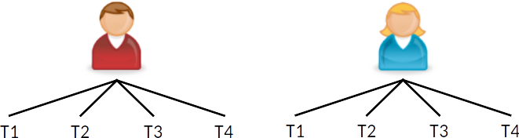

```{r setup, include=FALSE}
options(htmltools.dir.version = FALSE, digits = 3L)
library(tidyverse)
theme_set(theme_bw())
library(lme4)
library(rstan)
format_coef <- function(x, digits = 3L) {
  sprintf(paste0("%.", digits, "f"), x)
}
rmlead0 <- function(x, digits = 3L) {
  gsub("^0", "", format_coef(x, digits))
}
```

```{r, include=FALSE}
library(knitr)
hook_output <- knit_hooks$get("output")
knit_hooks$set(output = function(x, options) {
   lines <- options$output.lines
   if (is.null(lines)) {
     return(hook_output(x, options))  # pass to default hook
   }
   x <- unlist(strsplit(x, "\n"))
   more <- "..."
   if (length(lines)==1) {        # first n lines
     if (length(x) > lines) {
       # truncate the output, but add ....
       x <- c(head(x, lines), more)
     }
   } else {
     x <- c(more, x[lines], more)
   }
   # paste these lines together
   x <- paste(c(x, ""), collapse = "\n")
   hook_output(x, options)
 })
```

```{r load_refs, echo=FALSE, cache=FALSE}
library(RefManageR)
BibOptions(check.entries = FALSE, 
           bib.style = "authoryear", 
           cite.style = 'authoryear', 
           style = "markdown",
           hyperlink = FALSE, 
           dashed = FALSE)
myBib <- ReadBib("../references.bib", check = FALSE)
```

# Different Names

Hierarchical linear model `r Citep(myBib, "Raudenbush2002", before = "HLM; ")`

Mixed/Mixed-effects model `r Citep(myBib, "littell1996sas")`

Random coefficient model `r Citep(myBib, "DeLeeuw1986")`

Variance component model `r Citep(myBib, "Aitkin1986")`

---

# Roadmap

What are multilevel data?

Why use MLM?
- Avoid underestimated _SE_
- Cluster-specific (or person-specific) regression lines
- Avoid Ecological Fallacy

Recent advances

---

class: clear, inverse, center, middle

# What Are Multilevel Data?

---

# Multilevel Data

Nested Data
- Students in classrooms/schools
- Siblings in families
- Clients in therapy groups/therapists/clinics
- Employees in organizations in countries


---

# Multilevel Data

- Repeated measures in individuals

.center[

]

### Network Graph

```{r, echo=FALSE, dev='svg', out.width='100%', out.height='25%'}
DiagrammeR::grViz("
digraph boxes_and_circles {
  graph [overlap = true, fontsize = 24]

  node [penwidth = 0]
  # Schools
  A; B; C; D
  # Students
  1; 2; 3; 4; 5; 6; 7; 8; 9; 10; 11

  # edges
  edge [dir = 'none']
  A -> {1; 2; 3}
  B -> {4; 5}
  C -> {6; 7; 8; 9}
  D -> {10; 11}
}
")
```

---

# Applications of MLM

Psychotherapy
- Heterogeneity of treatment effectiveness across therapists

Educational research
- teacher expectations on students' performance

Organizational research
- Job strain and ambulatory blood pressure

---

# Applications of MLM (cont'd)

Cross-national/neighborhood research
- Sociopolitical influence on psychological processes (e.g., age and generalized trust)
- Post-materialism, locus of control, and concern for global warming

Longitudinal analysis/repeated measures
- Aging, self-esteem, and stress appraisal

---

# Example Data

```{r popdata, include=FALSE}
popdata <- haven::read_spss("../data/popular2.sav") %>% 
  select(pupil, class, extrav, sex, texp, popular, popteach) %>% 
  mutate(sex = as_factor(sex))
```

Sample simulated data on students' popularity from Hox, Moerbeek, 
& van de Schoot (2018)
- `r nrow(popdata)` pupils (level 1) in `r n_distinct(popdata$class)` classrooms
(level 2)

Main outcome:
- `popular`: `r attributes(popdata$popteach)$label` (0 to 10)

---

# Intraclass Correlation

.font80[ICC = ave _r_ between 2 obs (students) in same cluster (class)]


---

class: clear

Larger ICC = more information encoded at the class level

```{r, echo=FALSE, message=FALSE, dev='svg', fig.height=3, fig.width=8, fig.align='center'}
library(gridExtra)
set.seed(1)
popsub <- popdata %>%
  filter(class <= 10) %>% 
  mutate(class = factor(class))

# popsub %>% 
#   ggplot(aes(x = class, y = popular)) + 
#   geom_jitter(width = 0.1, height = 0, col = "grey40") + 
#   stat_summary(geom = "point", fun.y = "mean", col = "red", 
#                shape = 18, size = 4)
fake_dat1 <- tibble(class = as.character(rep(1:8, 20)), 
                    popular = rnorm(160, sd = sqrt(1.23)))
fake_dat1 <- fake_dat1 %>% group_by(class) %>% 
  mutate(popular = popular - mean(popular)) %>% 
  ungroup() %>% 
  mutate(popular + rnorm(8, mean = 4.712, sd = sqrt(0.063)))

p1 <- ggplot(fake_dat1, aes(x = class, y = popular)) + 
  geom_jitter(width = 0.1, height = 0, col = "grey40") + 
  stat_summary(geom = "point", fun.y = "mean", 
               shape = 24, size = 4, fill = "red") + 
  labs(title = "ICC close to 0")

p2 <- popsub %>%
  ggplot(aes(x = class, y = popular)) +
  geom_jitter(width = 0.1, height = 0, col = "grey40") +
  stat_summary(geom = "point", fun.y = "mean", 
               shape = 24, size = 4, fill = "red") + 
  labs(title = "ICC = .365")

fake_dat3 <- tibble(class = as.character(rep(1:8, 20)), 
                    popular = rnorm(160, mean = rnorm(8, mean = 4.712, sd = sqrt(1.23)), 
                                    sd = sqrt(0.063)))

p3 <- ggplot(fake_dat3, aes(x = class, y = popular)) + 
  geom_jitter(width = 0.1, height = 0, col = "grey40") + 
  stat_summary(geom = "point", fun.y = "mean", 
               shape = 24, size = 4, fill = "red") + 
  labs(title = "ICC = .95")

grid.arrange(p1, p2, p3, ncol = 3)
```

```{r m0, include=FALSE}
m0 <- lmer(popular ~ (1 | class), data = popdata)
```

---

class: clear, inverse, middle

.right-column[
## Why Use MLM?
- <span style="color:black">Avoid underestimated _SE_</span>
- <span style="color:black">Cluster-specific (or person-specific) regression lines</span>
- <span style="color:black">Avoid Ecological Fallacy</span>
]

---

# Dependent (Correlated) Observations

With clustered data, an assumption of OLS regression is violated

One score inform another score in the same cluster

Overlap: reduces effective information (\\(N_\text{eff}\\)) in data

.center[

]

???

Two students in the same class give less than two pieces of information

---

# Consequences

Assuming independent obs, OLS understates the uncertainty in the estimates
- _SE_ too small; CI too narrow

$${\uparrow}\, t = \frac{\hat\beta}{\mathit{SE}(\hat \beta)\, \downarrow}$$

---

# Comparing OLS with MLM

```{r, echo=FALSE, dev='svg', out.width='100%', out.height='30%'}
DiagrammeR::grViz("
digraph path1 {
  graph [layout = neato, fontsize = 24]

  node [shape = rectangle]
  # Schools
  texp [pos = '-1,0.5!']
  # Students
  popular [pos = '1,-0.5!']

  # edges
  texp -> popular
}
")
```

.font80[
```{r, echo=FALSE, results='asis'}
m1_lm <- lm(popular ~ texp, data = popdata)
m1 <- lmer(popular ~ texp + (1 | class), data = popdata)
library(texreg)
htmlreg(list(extract(m1_lm, include.rsquared = FALSE, 
                     include.adjrs = FALSE, 
                     include.rmse = FALSE), 
             extract(m1, include.aic = FALSE, 
                     include.bic = FALSE, 
                     include.loglik = FALSE, 
                     include.variance = FALSE)), 
        stars = numeric(0), digits = 3, caption = "", 
        single.row = TRUE, 
        html.tag = FALSE, head.tag = FALSE, body.tag = FALSE, 
        custom.model.names = c("OLS", "MLM"), doctype = FALSE)
```
]

---

class: clear

.pull-left[
```{r, echo=FALSE, message=FALSE, dev='svg', fig.width=4, fig.height=4}
ggplot(popdata, aes(x = texp, y = popular)) + 
  geom_point(size = 0.5, alpha = 0.5, aes(col = factor(class))) + 
  guides(col = FALSE) + 
  geom_smooth(method = "lm", col = "red", size = 0.5)
```
OLS:  
95% CI [`r confint(m1_lm, parm = "texp")[1] %>% format_coef`, 
        `r confint(m1_lm, parm = "texp")[2] %>% format_coef`]. 
]

.pull-right[
```{r, echo=FALSE, message=FALSE, dev='svg', fig.width=4, fig.height=4}
X <- m1@frame[ , 2]
var_yhat <- vcov(m1)[1, 1] + X^2 * vcov(m1)[2, 2] + 
  2 * X * vcov(m1)[2, 1]
m1_cis <- popdata %>% mutate(fit = predict(m1, re.form = NA), 
                             lwr = fit - 2 * sqrt(var_yhat), 
                             upr = fit + 2 * sqrt(var_yhat))
ggplot(popdata, aes(x = texp, y = popular)) + 
  geom_ribbon(data = m1_cis, aes(ymin = lwr, ymax = upr), fill = "skyblue") + 
  geom_point(size = 0.5, alpha = 0.5, aes(col = factor(class))) + 
  guides(col = FALSE) + 
  geom_abline(intercept = fixef(m1)[1], slope = fixef(m1)[2], 
              col = "red")
```
MLM:  
95% CI [`r confint(m1, parm = "texp")[1] %>% format_coef`, 
        `r confint(m1, parm = "texp")[2] %>% format_coef`]. 
]

---

# Type I Error Inflation


Depends on _design effect_: 1 + (cluster size - 1) × ICC

---

class: clear

`r Citet(myBib, "Lai2015")`: MLM needed when __design effect > 1.1__

For the popularity data, design effect  
= 1 + (20 - 1) × `r rmlead0(1 / (1 + 1 / m0@theta^2))` = 
`r format_coef(1 + (20 - 1) / (1 + 1 / m0@theta^2))`

\\(N_\text{eff}\\) reduces by almost 8 times: 2000 → 
`r round(2000 / (1 + (20 - 1) / (1 + 1 / m0@theta^2)))`
---

class: clear, inverse, middle

.right-column[
## Why Use MLM?
- Avoid underestimated _SE_
- <span style="color:black">Cluster-specific (or person-specific) regression lines</span>
- <span style="color:black">Avoid Ecological Fallacy</span>
]

---

# Random Coefficient Model

Lv-1 predictor: not just problem on _SE_, OLS also ignore potential 
heterogeneity in regression lines

Consider `extrav` --> `popular` (with `extrav` mean centered)
```{r, echo=FALSE, dev='svg', out.width='100%', out.height='25%'}
DiagrammeR::grViz("
digraph path1 {
  graph [layout = neato, fontsize = 24]

  node [shape = rectangle]
  # Students
  extravc [pos = '-1,0!']
  popular [pos = '1,0!']

  # edges
  extravc -> popular
}
")
```

---

# OLS With All Data

```{r p, message=FALSE, echo=FALSE, dev='svg', fig.width=6.5, fig.height=4.5, fig.align='center'}
class_col3 <- RColorBrewer::brewer.pal(n = 3, name = "Set1")
popdata <- popdata %>% 
  mutate(extravc = extrav - mean(extrav))
p <- ggplot(popdata, aes(x = extravc, y = popular))
p + geom_point(size = 0.5, alpha = 0.5) + 
  geom_smooth(method = "lm", se = FALSE, 
              fullrange = TRUE, col = "black")
```

---

# Think About Just One Classroom

$$\texttt{popular}_i = \beta_0 + \beta_1 \texttt{extrav}_i + e_i$$

```{r p1, message=FALSE, echo=FALSE, dev='svg', fig.width=6.5, fig.height=4.5, fig.align='center'}
p + geom_point(size = 0.5, alpha = 0.5, col = "grey") + 
  geom_point(data = popdata %>% filter(class == 1), 
             col = class_col3[1], size = 3, shape = 19) + 
  geom_smooth(data = popdata %>% filter(class == 1), 
              col = class_col3[1], method = "lm", se = FALSE)
```

---

# Think About Just One Classroom

$$\texttt{popular}_{i\color{red}{1}} = \beta_{0\color{red}{1}} + \beta_{1\color{red}{1}} \texttt{extrav}_{i\color{red}{1}} + e_{i\color{red}{1}}$$

```{r, ref.label="p1", message=FALSE, echo=FALSE, dev='svg', fig.width=6.5, fig.height=4.5, fig.align='center'}
p + geom_point(size = 0.5, alpha = 0.5, col = "grey") + 
  geom_point(data = popdata %>% filter(class == 1), 
             col = class_col3[1], size = 3, shape = 19) + 
  geom_smooth(data = popdata %>% filter(class == 1), 
              col = class_col3[1], method = "lm", se = FALSE)
```

---

# Think About Classroom 35

$$\texttt{popular}_{i\color{blue}{35}} = \beta_{0\color{blue}{35}} + \beta_{1\color{blue}{35}} \texttt{extrav}_{i\color{blue}{35}} + e_{i\color{blue}{35}}$$

```{r p2, message=FALSE, echo=FALSE, dev='svg', fig.width=6.5, fig.height=4.5, fig.align='center'}
p + geom_point(size = 0.5, alpha = 0.5, col = "grey") + 
  geom_point(data = popdata %>% filter(class == 35), 
             col = class_col3[2], size = 3, shape = 17) + 
  geom_smooth(data = popdata %>% filter(class == 35), 
              col = class_col3[2], method = "lm", se = FALSE)
```

---

# Classroom 14

$$\texttt{popular}_{i\color{green}{14}} = \beta_{0\color{green}{14}} + \beta_{1\color{green}{14}} \texttt{extrav}_{i\color{green}{14}} + e_{i\color{green}{14}}$$

```{r p3, message=FALSE, echo=FALSE, dev='svg', fig.width=6.5, fig.height=4.5, fig.align='center'}
p + geom_point(size = 0.5, alpha = 0.5, col = "grey") + 
  geom_point(data = popdata %>% filter(class == 14), 
             col = class_col3[3], size = 3, shape = 15) + 
  geom_smooth(data = popdata %>% filter(class == 14), 
              col = class_col3[3], method = "lm", se = FALSE)
```

---

class: clear

### MLM: efficiently get cluster-specific regression lines

$$\texttt{popular}_{i\color{purple}{j}} = \beta_{0\color{purple}{j}} + \beta_{1\color{purple}{j}} \texttt{extrav}_{i\color{purple}{j}} + e_{i\color{purple}{j}}$$

```{r m2s, include=FALSE}
library(lme4)
m2s <- lmer(popular ~ extravc + (extravc | class), data = popdata)
print(summary(m2s, correlation = FALSE), show.resids = FALSE, digits = 2L)
```

```{r, message=FALSE, echo=FALSE, dev='svg', fig.width=6.5, fig.height=4.5, fig.align='center'}
# Get the predicted values for plotting from `lme4`
predict_ran_slp <- popdata %>% 
  select(class, extravc, texp) %>% 
  mutate(fit = predict(m2s))
ggplot(data = predict_ran_slp, 
       aes(x = extravc, y = fit, color = factor(class))) +
  geom_smooth(method = "lm", se = FALSE, size = 0.5) + 
  labs(y = "popular") + 
  geom_abline(intercept = m2s@beta[1], slope = m2s@beta[2], 
              size = 1.5) + 
  guides(color = FALSE)
```

---

# Fixed Effect Estimates

.code40[
```{r m2s_tab, echo=FALSE, results='asis'}
htmlreg(extract(m2s, include.aic = FALSE, include.bic = FALSE, 
                include.loglik = FALSE, include.variance = TRUE, 
                include.nobs = FALSE, include.groups = FALSE), 
        stars = numeric(0), digits = 3, caption = "", 
        single.row = TRUE, 
        custom.coef.names = c("(intercept)", "extravc"),
        custom.gof.names = c("Var(intercept)", "Var(slope)", "Cov(int, slope)", "Var(residual)"), 
        html.tag = FALSE, head.tag = FALSE, body.tag = FALSE, 
        custom.model.names = "", doctype = FALSE)
```
]

```{r, include=FALSE}
m2s_ci <- confint(m2s, parm = "extravc")
```


Average slope of `extrav` = `r m2s@beta[2]`, 95% CI 
[`r m2s_ci[1]`, `r m2s_ci[2]`]. 

---

# Random Effect __Variance__ Estimates

.code40[
```{r, ref.label="m2s_tab", echo=FALSE, results='asis'}

```
]

```{r, include=FALSE}
m2s_vc <- VarCorr(m2s) %>% as.data.frame()
```

Variance of intercepts = `r m2s_vc[1, "vcov"]` (_SD_ = `r m2s_vc[1, "sdcor"]`)

Variance of slopes = `r m2s_vc[2, "vcov"]` (_SD_ = `r m2s_vc[2, "sdcor"]`)

---

class: clear

With heterogeneity in slopes, OLS gives underestimated _SE_ `r Citep(myBib, "Lai2015")`

.pull-left[
.font80[
New research questions: Detecting and explaining heterogeneity in slopes (i.e.,
cross-level interaction)
]
]

.pull-right[
```{r, message=FALSE, echo=FALSE, dev='svg', fig.width=4.5, fig.height=4, fig.align='center'}
ggplot(data = predict_ran_slp, 
       aes(x = extravc, y = fit, group = factor(class), 
           col = texp > 15)) +
  geom_smooth(method = "lm", se = FALSE, size = 0.5) + 
  labs(y = "popular") + 
  geom_abline(intercept = m2s@beta[1], slope = m2s@beta[2], 
              size = 1.5)
```
]

---

class: clear, inverse, middle

.right-column[
## Why Use MLM?
- <span style="color:black">Avoid underestimated _SE_</span>
- Cluster-specific (or person-specific) regression lines
- <span style="color:black">Avoid Ecological Fallacy</span>
]

---

# Ecological Fallacy

Association between two variables can be different across levels

```{r, echo=FALSE, dev='svg', out.width='100%', out.height='25%'}
DiagrammeR::grViz("
digraph path1 {
  graph [layout = neato, fontsize = 24]

  node [shape = rectangle]
  # Students
  stu_ach [pos = '-1.5,0!', label = 'Student \\nacademic achievement']
  # sch_ach [pos = '0,-1.5!', label = 'School average \\nacademic achievement']
  stu_asc [pos = '1.5,0!', label = 'Student academic \\nself-concept']

  # edges
  # stu_ach -> sch_ach; 
  stu_ach -> stu_asc [label = '+ve'];
  # sch_ach -> stu_asc;
}
")
```

???
students' self-perception in academics
---

# Ecological Fallacy

Association between two variables can be different across levels

```{r, echo=FALSE, dev='svg', out.width='100%', out.height='70%'}
DiagrammeR::grViz("
digraph path1 {
  graph [layout = neato, fontsize = 24]

  node [shape = rectangle]
  # Students
  stu_ach [pos = '-1.5,0!', label = 'Student \\nacademic achievement']
  sch_ach [pos = '0,-1.5!', label = 'School average \\nacademic achievement']
  stu_asc [pos = '1.5,0!', label = 'Student academic \\nself-concept']

  # edges
  stu_ach -> sch_ach; 
  stu_ach -> stu_asc [label = '+ve'];
  # sch_ach -> stu_asc;
}
")
```

---

# Ecological Fallacy

Association between two variables can be different across levels

```{r, echo=FALSE, dev='svg', out.width='100%', out.height='70%'}
DiagrammeR::grViz("
digraph path1 {
  graph [layout = neato, fontsize = 24]

  node [shape = rectangle]
  # Students
  stu_ach [pos = '-1.5,0!', label = 'Student \\nacademic achievement']
  sch_ach [pos = '0,-1.5!', label = 'School average \\nacademic achievement']
  stu_asc [pos = '1.5,0!', label = 'Student academic \\nself-concept']

  # edges
  stu_ach -> sch_ach; 
  stu_ach -> stu_asc [label = '+ve'];
  sch_ach -> stu_asc [label = '-ve', color = 'red', fontcolor = 'red'];
}
")
```

---

# Big Fish Small Fond Effect

Ignoring clustering

```{r, echo=FALSE, dev='svg', fig.width=6.5, fig.height=4.5, fig.align='center'}
set.seed(3)
x <- rnorm(24, mean = c(0, 2.5, 5))
sch <- rep(1:3, 8)
y <- 1 + 1.1 * x - 0.5 * (sch - 1) * 2.5 + rnorm(24, sd = 0.3)
df_bflp <- data_frame(x, sch, y)
ggplot(df_bflp, aes(x, y)) + 
  labs(x = "Achievement", y = "Academic Self-Concept") + 
  geom_point(aes(shape = factor(sch)), size = 4) + 
  geom_smooth(method = "lm", se = FALSE) + 
  guides(shape = FALSE)
```

---

# Big Fish Small Fond Effect

+ve at student level

```{r, echo=FALSE, dev='svg', fig.width=6.5, fig.height=4.5, fig.align='center'}
ggplot(df_bflp, aes(x, y, col = factor(sch), shape = factor(sch))) + 
  labs(x = "Achievement", y = "Academic Self-Concept") + 
  geom_point(size = 4) + 
  geom_smooth(method = "lm", se = FALSE) + 
  guides(shape = FALSE, col = FALSE)
```

---

# Big Fish Small Fond Effect

-ve contextual effect in a more competitive school

```{r, echo=FALSE, dev='svg', fig.width=6.5, fig.height=4.5, fig.align='center'}
ggplot(df_bflp, aes(x, y, col = factor(sch), shape = factor(sch))) + 
  labs(x = "Achievement", y = "Academic Self-Concept") + 
  geom_point(size = 4) + 
  geom_smooth(method = "lm", se = FALSE) + 
  guides(shape = FALSE, col = FALSE) + 
  geom_segment(x = 1.4, xend = 1.4, 
               y = 2.8, yend = 1.4, 
               arrow = arrow(length = unit(0.1, "inches")), 
               col = "purple")
```

---

class: clear, inverse, middle

.right-column[
## Why Use MLM?
- <span style="color:black">Avoid underestimated _SE_</span>
- <span style="color:black">Cluster-specific (or person-specific) regression lines</span>
- Avoid Ecological Fallacy
]

---

# Growth Curve Analysis

Individual as "cluster"

```{r, echo=FALSE, message=FALSE, dev='svg', fig.width=6.5, fig.height=4.5, fig.align='center'}
# tolerance <- read_csv("https://stats.idre.ucla.edu/wp-content/uploads/2016/02/tolerance1_pp.txt")
tolerance <- readRDS("../data/tolerance.RDS")
tolerance %>% 
  ggplot(aes(x = time, y = tolerance, col = factor(male), group = id)) + 
  geom_line()
```

---

class: clear, inverse, center, middle

# Recent Advances

---

# Other Forms of Clustering

Three-level 

```{r, echo=FALSE, dev='svg', out.width='100%', out.height='35%'}
DiagrammeR::grViz("
digraph boxes_and_circles {
  graph [overlap = true, fontsize = 30]

  node [penwidth = 0]
  # District
  AB [label='Therapist 1']
  CD [label='Therapist 2']
  # Schools
  A [label='Therapy group A']
  B [label='Therapy group B'] 
  C [label='Therapy group C']
  D [label='Therapy group D']
  # Students
  1; 2; 3; 4; 5; 6; 7; 8; 9; 10; 11

  # edges
  edge [dir = 'none']
  AB -> {A; B}
  CD -> {C; D}
  A -> {1; 2; 3}
  B -> {4; 5}
  C -> {6; 7; 8; 9}
  D -> {10; 11}
}
")
```

---

# Other Forms of Clustering

Cross-classification

```{r, echo=FALSE, dev='svg', out.width='100%', out.height='35%'}
DiagrammeR::grViz("
digraph boxes_and_circles {
  graph [overlap = true, fontsize = 30]

  node [penwidth = 0]
  # District
  n1 [label='Neighborhood 1']
  n2 [label='Neighborhood 2']
  n3 [label='Neighborhood 3']
  # Schools
  A [label='School A']
  B [label='School B'] 
  C [label='School C']
  D [label='School D']
  # Students
  1; 2; 3; 4; 5; 6; 7; 8; 9; 10; 11

  # edges
  edge [dir = 'none']
  A -> {1; 2; 3}
  B -> {4; 5}
  C -> {6; 7; 8; 9}
  D -> {10; 11}
  {1; 4; 5} -> n1
  {2; 3; 6; 7} -> n2
  {8; 9; 10; 11} -> n3
}
")
```

Partial Nesting

```{r, echo=FALSE, dev='svg', out.width='100%', out.height='25%'}
DiagrammeR::grViz("
digraph boxes_and_circles {
  graph [overlap = true, fontsize = 30]

  node [penwidth = 0]
  # Schools
  A [label='Therapy group A']
  B [label='Therapy group B'] 
  C [label='Therapy group C']
  D [label='Individual therapy']
  # Students
  1; 2; 3; 4; 5; 6; 7; 8; 9; 10; 11

  # edges
  edge [dir = 'none']
  A -> {1; 2; 3}
  B -> {4; 5}
  C -> {6; 7} 
  D -> {8; 9; 10; 11} [style = invis]
}
")
```

---

# Effect Size for Multilevel Trials

Effect size (e.g., Cohen's _d_) required by many reporting standards
- Little guidance on how to compute them

Two-level trials: `r Citet(myBib, "Hedges2007a")`

`r Citet(myBib, "Lai2014")`: (partially) cross-classified

`r Citet(myBib, "Lai2016")`: partially nested

`r Citet(myBib, "Rights2018")`: Defining $R^2$ for MLM

---

# `r Citet(myBib, "Stice2006")`

Eating disorder prevention  
Outcome: Thin-ideal internalization (TII)

.font60[
```{r, echo=FALSE, results='asis'}
tibble(`Dissonance-based (Treatment)` = 
         c("\\(N^T\\) = 114 females", "17 groups", 
           "\\(n\\) = 6 to 10", "ICC = .08, \\(\\mathit{deff}\\) = 1.5"), 
       `Expressive writing (Control)` = 
         c("\\(N^C\\) = 126 females", rep("",  3))) %>% 
  knitr::kable(format = "html")
```
]

```{r, echo=FALSE, dev='svg', out.width='100%', out.height='25%'}
DiagrammeR::grViz("
digraph boxes_and_circles {
  graph [overlap = true, fontsize = 30]

  node [penwidth = 0]
  # Schools
  A [label='Treatment group A']
  B [label='Treatment group B'] 
  C [label='Treatment group C']
  D [label='Control']
  # Students
  1; 2; 3; 4; 5; 6; 7; 8; 9; 10; 11

  # edges
  edge [dir = 'none']
  A -> {1; 2; 3}
  B -> {4; 5}
  C -> {6; 7} 
  D -> {8; 9; 10; 11} [style = invis]
}
")
```

---

class: clear

$\hat \beta_\text{TREAT}$ = -0.44, _SE_ = 0.09<sup>[1]</sup>

How many *SD*s does that correspond to?

.footnote[
[1] OLS underestimates _SE_ by 25%; falsely assuming full clustering estimates
_SE_ by 15%. 
]

---

# `r Citet(myBib, "Lai2016")`

$$\hat \delta = \frac{\hat \beta_\text{TREAT}}{\hat \sigma^2_\text{person}}$$

$$V(\hat \delta) = \frac{V(\hat \beta_\text{TREAT})}{\hat \sigma^2_\text{person}} + 
                   \frac{\hat \delta^2 V(\hat \sigma^2_\text{person})}{4 (\hat \sigma^2_\text{person})^2}$$
                   
For `r Citet(myBib, "Stice2006")`, $\hat \delta$ = -0.98, 95% CI = [-1.4, -0.6]

---

# Multilevel Bootstrapping

Useful for
- CI for effect size
- testing multilevel mediation

`bootmlm` R package: currently implements 6 flavors of bootstrapping and 5 types
of CI estimates

---

class: clear, top

```{r, echo=FALSE, dev='svg', out.width='100%', out.height='25%'}
DiagrammeR::grViz("
digraph path1 {
  graph [layout = neato, fontsize = 24]

  node [shape = rectangle]
  # Students
  free [pos = '-1.5,0!', label = 'School \\npoverty']
  smorale [pos = '0,0!', label = 'School \\nmorale']
  late [pos = '1.5,-1!', label = 'Student \\ntardiness']

  # edges
  free -> smorale
  free -> late
  smorale -> late
}
")
```


---

# Accounting for Survey Design

`r Citet(myBib, "Lai2018")`
- Apply finite population correction for cross-cultural research to obtain
more accurate _SE_ (and improved power)

Wen & Lai (in preparation)
- A multilevel Bayesian semi-parametric bootstrap procedure to handle sampling 
weights with unequal probability samples

---

class: clear, top

.font50[
`r Citep(myBib, "Lai2018", after = ", Figure 5")`
]


---

# MLM of Non-Normal Outcomes

Ordinal? Counts? Zero-inflated? Proportions? Response time? Survival? 

These are made easy with Bayesian estimation and the `brms` 
`r Citep(myBib, "Burkner2018")`. 


---

# Summary


---

# Bibliography

.font70[
```{r, 'refs', results='asis', echo=FALSE}
PrintBibliography(myBib, end = 4L)
```
]

---

class: clear

.font70[
```{r, 'refs2', results='asis', echo=FALSE}
PrintBibliography(myBib, start = 5L, end = 9L)
```
]

---

class: clear

.font70[
```{r, 'refs3', results='asis', echo=FALSE}
PrintBibliography(myBib, start = 10L)
```
]

---

class: clear, center, middle, inverse

# Thanks!

Slides created via the R package [**xaringan**](https://github.com/yihui/xaringan).
